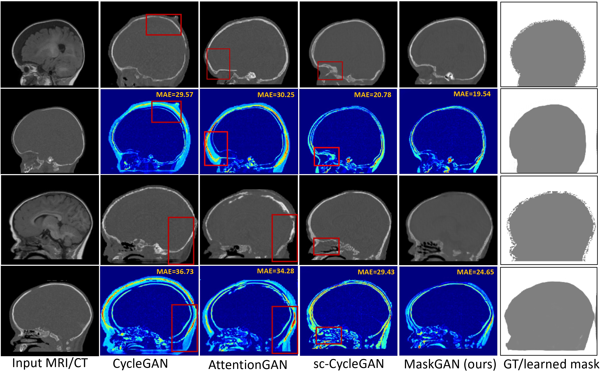

# MaskGAN for Unpaired MR-to-CT Translation

## MaskGAN Framework
 A novel unsupervised MR-to-CT synthesis method that preserves the anatomy under the explicit supervision of coarse masks without using costly manual annotations. MaskGAN bypasses the need for precise annotations, replacing them with standard (unsupervised) image processing techniques, which can produce coarse anatomical masks. 
Such masks, although imperfect, provide sufficient cues for MaskGAN to capture anatomical outlines and produce structurally consistent images.


## Comparsion with State-of-the-Art Methods on Paediatric MR-CT Synthesis



The repository offers the official implementation of our paper in PyTorch.


## Installation
### Option 1: Directly use our Docker image
- We have created a public docker image `docker pull stevephan46/maskgan:d20b79d4731210c9d287a370e37b423006fd1425`.
- Script to pull docker image and run docker container for environment setup:
```bash
docker pull stevephan46/maskgan:d20b79d4731210c9d287a370e37b423006fd1425
docker run --name maskgan --gpus all --shm-size=16g -it -v /path/to/data/root:/data stevephan46/maskgan:d20b79d4731210c9d287a370e37b423006fd1425
```
- Mount the folder storing your data folder in `-v /path/to/data/root:/data`.
- In the docker container, clone the code and follow next following steps.

### Option 2: Install environments locally

- This code uses PyTorch 1.8.1, Python 3.8 and [apex](https://github.com/NVIDIA/apex) for half-precision training support.

- Please install PyTorch and [apex](https://github.com/NVIDIA/apex), then install other dependencies by
```bash
pip install -r requirements.txt
```

## Dataset Preparation and Mask Generations
Refer to [preprocess/README.md](./preprocess/README.md) file.

## MaskGAN Training and Testing
- Sampled training script is provided in train.sh
- Modify image augmentations as needed `--load_size` (resize one dimension to be a fixed size), `--pad_size` (pad both dimensions to an equal size), `--crop_size` (crop both dimensions to an equal size).
- Train a model:
```
sh train.sh
```
- `lambda_mask` and `lambda_shape` specify hyper-parameters of our proposed mask loss and shape consistency loss.
- `opt_level` specifies Apex mixed-precision optimization level. The default is `O0` which is full FP32 training. If low GPU memory, you can use O1 or O2 for mixed precision training.
- Training command:
```
python train.py --dataroot dataroot --name exp_name --gpu_ids 0 --display_id 0 --model mask_gan --netG att 
--dataset_mode unaligned --pool_size 50 --no_dropout
--norm instance --lambda_A 10 --lambda_B 10 --lambda_identity 0.5 --lambda_mask 1.0 --lambda_shape 0.5 --load_size 150 --pad_size 225 --crop_size 224 --preprocess resize_pad_crop --no_flip
--batch_size 4 --niter 40 --niter_decay 40 --display_freq 1000 --print_freq 1000 --n_attentions 5
```
- For your own experiments, you might want to specify --netG, --norm. Our mask generators `netG` are `att` and `unet_att`.
- To continue model training, append `--continue_train --epoch_count xxx` on the command line.
- Test the model:
```
sh test.sh
```
- The results will be saved at `./results/exp_name`. Use `--results_dir {directory_path_to_save_result}` to specify the results directory. There will be four folders `fake_A`, `fake_B`, `real_A`, `real_B` created in `results`.

## Evaluate results
- The script `eval.sh` is provided as an example. Modify the variable `exp_name` to match your experiment name specified by parameter `--name` when running test.py.

## Citation
If you use this code for your research, please cite our papers.

```
@inproceedings{phan2023maskgan,
  title = {Structure-Preserving Synthesis: {MaskGAN} for Unpaired {MR-CT} Translation},
  author = {Phan, Minh Hieu and Liao, Zhibin and Verjans, Johan and To, Minh-Son},
  booktitle = {International Conference on Medical Image Computing and Computer Assisted Intervention (MICCAI)},
  year = {2023}
}
```

## Acknowledgments
This source code is inspired by [CycleGAN](https://github.com/junyanz/pytorch-CycleGAN-and-pix2pix) and [AttentionGAN](https://github.com/Ha0Tang/AttentionGAN). 

