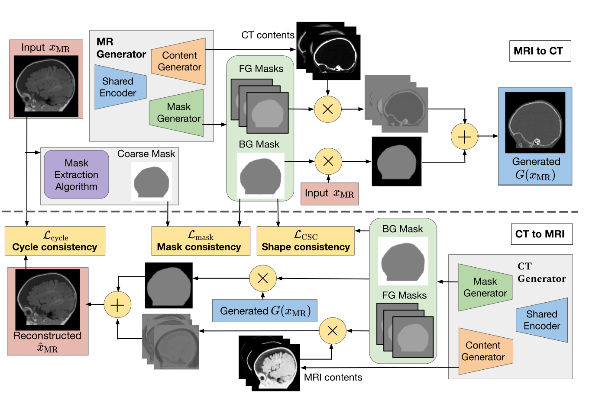

# MaskGAN for Unpaired MR-to-CT Translation [MICCAI2023]

 [](https://arxiv.org/pdf/2307.16143) [](cite.bib)

## 📢 Updates!

* New publication is coming out! **Mixed-view Refinement MaskGAN: Anatomical Preservation for Unpaired MRI-to-CT Synthesis**. Stay tuned!
* **Refinement MaskGAN version**: An extended model, which refined images using a simple, yet effective multi-stage, multi-plane approach is develop to improve the volumetric definition of synthetic images.
* 20/07/2024 - **Model enhancements**: We include selection strategies to choose similar MRI/CT matches based on the position of slices.
* 01/08/2024 - **Extensive experiments**: We conduct experiments on two additional public datasets: an adult brain CERMEP-IDB-MRXFDG,and an abdominal datasets for downstream segmentation eval. We re-evaluate synthesis quality in raw Houndsfield Unit (HU) to measure clinical utility!
* 01/08/2024 - **Checkpoint sharing**: All checkpoints are shared for public use. Inference and evaluation scripts are released!

## 🏆 MaskGAN Framework

A novel unsupervised MR-to-CT synthesis method that:
- Preserves the anatomy under the explicit supervision of coarse masks without using costly manual annotations. MaskGAN bypasses the need for precise annotations, replacing them with standard (unsupervised) image processing techniques, which can produce coarse anatomical masks.
- Introduces a Shape consistency loss to preserve the overall structure of images after a cycle of translation.



## Comparison with State-of-the-Art Methods on Paediatric MR-CT Synthesis


The repository offers the official implementation of our paper in PyTorch. The next reflects some results of using **MaskGAN** in different benchmarks. Results are shown over original values on radiometric values for MRI and Hounsfield unit (HU) for CT scans. In addition, the best weights obtained during the training stage are shared to be used for inference or retraining.


Unpaired Pediatric brain MRI-CT images (Private dataset) 
| **Methods**                   | **Type** | **MRI→CT** |        |        | **CT→MRI** |        |        |
|-------------------------------|----------|---------------------|--------|--------|-----------------------|--------|--------|
|                               |          | **MAE ↓**           | **PSNR ↑** | **SSIM (%) ↑** | **MAE ↓**             | **PSNR ↑** | **SSIM (%) ↑** |
| CycleGAN [Zhu2017,ICCV]            | 2D       | 80.86               | 21.33  | 75.07  | 118.15                | 15.04  | 65.26  |
| AttentionGAN [Tang2021,TNLS]       | 2D       | 81.67               | 21.24  | 75.94  | 115.30                | 16.22  | 67.13  |
| QS-Attn-Seg [Liu2023,arxiv]         | 3D       | 63.55               | 22.32  | 81.42  | 113.82                | 16.71  | 67.97  |
| MaskGAN (w/o Shape)           | 2D       | 62.28               | 22.56  | 82.36  | 112.88                | 16.83  | 68.34  |
| [MaskGAN (Ours)](https://drive.google.com/file/d/15e1pS2V2DDdQQqIdEdD7cpZstyQuSG_i/view?usp=drive_link)                | 2D       | **62.13**             | **22.89** | **82.50** | **112.75**              | **16.95** | **68.44** |


Unpaired Adult brain MRI/CT images. Original dataset are paired ([Link](https://www.ncbi.nlm.nih.gov/pmc/articles/PMC8446124/)) 

| **Methods**                   | **Type** | **MRI→CT** |        |        | **CT→MRI** |        |        |
|-------------------------------|----------|---------------------|--------|--------|-----------------------|--------|--------|
|                               |          | **MAE ↓**           | **PSNR ↑** | **SSIM (%) ↑** | **MAE ↓**             | **PSNR ↑** | **SSIM (%) ↑** |
| CycleGAN [Zhu2017,ICCV]            | 2D       | 52.10               | 21.43  | 84.12  | 71.57                 | 19.67  | 62.07  |
| AttentionGAN [Tang2021,TNLS]       | 2D       | 51.41               | 21.48  | 84.15  | 72.23                 | 19.88  | 63.75  |
| QS-Attn-Seg [Liu2023,arxiv]         | 3D       | 46.71               | 22.29  | 86.01  | 63.98                 | 20.08  | 66.23  |
| MaskGAN (w/o Shape)           | 2D       | 46.26               | 22.32  | 86.05  | 63.60                 | 20.12  | 67.68  |
| [MaskGAN (Ours)](https://drive.google.com/file/d/1FUTEDrw8G92zgc0rRZ4TRxHFgkkPhk7R/view?usp=drive_link)                | 2D       | **45.11**             | **22.45** | **86.31** | **62.95**               | **20.53** | **67.87** |


## 🛠️ Installation
### Option 1: Directly use our Docker image
- We have created a public docker image `stevephan46/maskgan:d20b79d4731210c9d287a370e37b423006fd1425`.
- Script to pull docker image and run docker container for environment setup:
```bash
docker pull stevephan46/maskgan:d20b79d4731210c9d287a370e37b423006fd1425
docker run --name maskgan --gpus all --shm-size=16g -it -v /path/to/data/root:/data stevephan46/maskgan:d20b79d4731210c9d287a370e37b423006fd1425
```
- Mount the folder storing your data folder in `-v /path/to/data/root:/data`.
- In the docker container, clone the code and follow next following steps.

### Option 2: Install environments locally

- This code uses PyTorch 1.8.1, Python 3.8 and [apex](https://github.com/NVIDIA/apex) for half-precision training support.

- Please install PyTorch and [apex](https://github.com/NVIDIA/apex), then install other dependencies by
```bash
pip install -r requirements.txt
```

## 📚 Dataset Preparation and Mask Generations
Refer to [preprocess/README.md](./preprocess/README.md) file.

## 🚀 Model Testing
```
python test.py --dataroot dataroot --name exp_name --gpu_ids 0 --model mask_gan --netG att 
--dataset_mode unaligned --no_dropout --load_size 150 --pad_size 225 --crop_size 224 --preprocess resize_pad_crop --no_flip
--batch_size 4
```
The results will be saved at `./results/exp_name`. Use `--results_dir {directory_path_to_save_result}` to specify the results directory. There will be four folders `fake_A`, `fake_B`, `real_A`, `real_B` created in `results`.

## 💾 Use of pretrained weights

This [zip file](https://drive.usercontent.google.com/download?id=15e1pS2V2DDdQQqIdEdD7cpZstyQuSG_i&export=download) contains trained weights of MaskGAN run over MRI/CT pediatric brain dataset. To use them, unzip the contents in the folder `pretrained_weights`. You can use them as pretrained weights during your training step or using directly for testing with the defaults parameters. Just add the next parameter.

```
--use_pretrained_weights True
```

You can use other pretrained weights, which are shown in the first table of this page. 

## 🔍 Evaluate results
- The script `evaluation.py` allows to execute a validation of results converting values of MRI and CT images to their original units (Magnetic field and Hounsfield units (HU), respectively). You need to indicate the folder `exp_name` of the images that you want to evaluate running:

```
python evaluation.py --results_folder exp_name
```

Results for MRI-to-CT synthesis generation and CT-to-MRI are shown.

## 🚀 MaskGAN Training
- Sampled training script is provided in train.sh
- Modify image augmentations as needed `--load_size` (resize one dimension to be a fixed size), `--pad_size` (pad both dimensions to an equal size), `--crop_size` (crop both dimensions to an equal size).
- Train a model:
  - `lambda_mask` and `lambda_shape` specify hyper-parameters of our proposed mask loss and shape consistency loss.
  - `opt_level` specifies Apex mixed-precision optimization level. The default is `O0` which is full FP32 training. If low GPU memory, you can use O1 or O2 for mixed precision training.
- Training command:
```
python train.py --dataroot dataroot --name exp_name --gpu_ids 0 --display_id 0 --model mask_gan --netG att 
--dataset_mode unaligned --pool_size 50 --no_dropout
--norm instance --lambda_A 10 --lambda_B 10 --lambda_identity 0.5 --lambda_mask 1.0 --lambda_shape 0.5 --load_size 150 --pad_size 225 --crop_size 224 --preprocess resize_pad_crop --no_flip
--batch_size 4 --niter 40 --niter_decay 40 --display_freq 1000 --print_freq 1000 --n_attentions 5
```
- For your own experiments, you might want to specify --netG, --norm. Our mask generators `netG` are `att` and `unet_att`.
- To continue model training, append `--continue_train --epoch_count xxx` on the command line.


## 📜 Citation
If you use this code for your research, please cite our papers.

```
@inproceedings{phan2023structure,
  title={Structure-preserving synthesis: {MaskGAN} for unpaired mr-ct translation},
  author={Phan, Vu Minh Hieu and Liao, Zhibin and Verjans, Johan W and To, Minh-Son},
  booktitle={International Conference on Medical Image Computing and Computer-Assisted Intervention},
  pages={56--65},
  year={2023},
  organization={Springer}
}
```

## 🙏 Acknowledgments
This source code is inspired by [CycleGAN](https://github.com/junyanz/pytorch-CycleGAN-and-pix2pix) and [AttentionGAN](https://github.com/Ha0Tang/AttentionGAN). 

